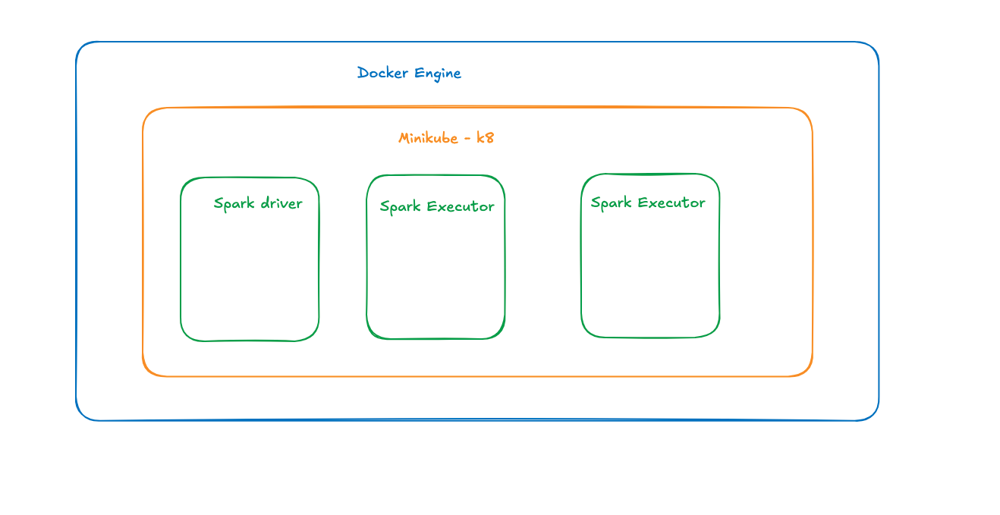

# spark-on-k8

A repository to demonstrate the setup and use of Apache Spark running on a Kubernetes cluster using Minikube

Aim : 
1. Setup local kubernetes(k8) on docker engine using minikube.
2. Setup a scalable apache spark cluster on k8 - bitnami and helm ??
3. Run a basic spark job
4. Try fraud detection use case with Mlib.

1. local kubernetes(k8) on docker engine using minikube

    - Prerequisite : Docker engine
    - brew install minikube
    - minikube start --driver=docker
    - kubectl get nodes
   

2. Setup a scalable apache spark cluster on k8 - bitnami and helm ??
     
     - brew install helm
     - helm repo add bitnami https://charts.bitnami.com/bitnami
     - helm repo update
     - helm install spark bitnami/spark
     - kubectl get pods

     Spark UI : 
     - kubectl port-forward svc/spark-master-svc 8080:80
     - http://localhost:8080

     Create name space and service account   
     - create namespace spark
     - kubectl apply -f spark-service-account.yaml

     Create a docker image with the test python script   
     - Dockerfile
     - docker build -t my-spark-app . 

     Submit Job : 

     ###
     spark-submit \
  --master k8s://https://$(minikube ip):8443 \
  --deploy-mode cluster \
  --name simple-word-count-job \
  --conf spark.kubernetes.authenticate.driver.serviceAccountName=spark \
  --conf spark.kubernetes.container.image=my-spark-app \
  --conf spark.kubernetes.namespace=spark \
  local:///opt/spark/work-dir/simple_word_count.py   

     ###  

Clean up :
- helm uninstall spark
- minikube delete